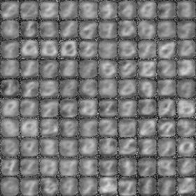
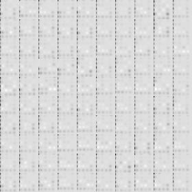

# DRAW-Tensorflow

This is a tensorflow implementation of DRAW model from the paper https://arxiv.org/pdf/1502.04623.pdf

I have coded both the attention model and one without attention. Output for the same are as follow. To learn more about the draw network you can read in this blog by [evjang](http://blog.evjang.com/2016/06/understanding-and-implementing.html).

You can also find the trained model in the output directory.

Results:

1. Draw without attention:

<p align="center">  </p>


2. Draw with attention:

<p align="center">  </p>

1. To run the already trained model

	```python draw_main.py --test True --model draw```

	and for model with attention 

	```python draw_main.py --test True --model draw_attn```


2. To train the model you can do following for model with attention

	```python draw_main.py --model draw```

	and for model with attention 

	```python draw_main.py --model draw_attn```
